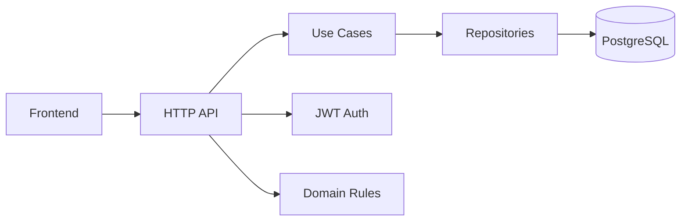

# Meeting Rooms API

<p align="center">
  <strong>🇬🇧 English</strong> • <a href="README.ru.md">🇷🇺 Русский</a>
</p>

<p align="center">
  
  
  
  
  
  
  
  
</p>

<p align="center">
  <strong>A production-style pet project for managing meeting rooms with real business rules, authentication, transactional flows, API documentation, and a polished demo UI.</strong>
</p>

> This is not just another CRUD API. It is a complete backend + frontend example showcasing clean architecture, JWT-based security, database migrations, transactional business logic, OpenAPI documentation, automated testing, and deployment-ready structure.

---

## 🎯 Project Overview

Meeting Rooms API is a full-stack service for booking meeting rooms inside a company. The project covers the whole workflow:

- creating meeting rooms;
- configuring availability schedules;
- generating time slots automatically;
- booking available slots;
- viewing personal and admin-wide bookings;
- securing the API with JWT-based authentication;
- exposing a small but functional web UI for day-to-day usage.

The goal of this project is to demonstrate not only basic CRUD operations, but also practical backend engineering decisions that matter in real products.

---

## ✨ Why This Project Stands Out

This repository is designed to look like a serious portfolio project rather than a toy exercise. It combines:

- clean architecture with separate layers for adapters, use cases, domain logic, and infrastructure;
- real domain rules such as slot generation, booking validation, and cancellation behavior;
- transactional consistency for critical operations;
- database migrations and a PostgreSQL-backed persistence layer;
- OpenAPI documentation and Swagger UI;
- automated unit, integration, and end-to-end tests;
- code generation with sqlc, mockery, and golangci-lint to keep the backend consistent and maintainable;
- a lightweight frontend to showcase the API in action.

---

## 🧩 Core Features

### For administrators
- create meeting rooms;
- define room schedules;
- inspect all bookings with pagination-friendly listing;
- manage room availability through a simple admin workflow.

### For regular users
- browse available rooms;
- inspect free slots for a selected date;
- book an available slot;
- view future personal bookings;
- cancel bookings through an idempotent flow.

### Business logic highlights
- slots are generated from schedules;
- slot duration is fixed at 30 minutes;
- only one active booking per slot is allowed;
- booking a slot in the past is rejected;
- cancellation remains safe and predictable even under repeated requests.

---

## 🧠 Architecture and Design Principles



The project follows a layered structure built around clear boundaries:

- adapter layer for HTTP handling;
- application layer for use cases and orchestration;
- domain layer for business rules and entities;
- infrastructure layer for JWT, password hashing, and persistence integration.

Additional implementation choices include lazy slot generation, deterministic UUID usage for slot identity, transactional booking updates, and a few algorithmic decisions that make the system feel closer to production: slot generation is done lazily to avoid bloating the database, time slots are constrained to a 30-minute grid for cleaner scheduling, and cancellation is handled idempotently so repeated calls remain safe and predictable.

---

## 🎬 Demo Walkthroughs

### 1. Registration and login


### 2. Admin room and schedule management


### 3. Admin booking audit flow


### 4. User booking experience


---

## 📚 API and Documentation

The API is described using OpenAPI and exposed through Swagger UI:

- [backend/api/openapi.yaml](backend/api/openapi.yaml)

### Swagger / OpenAPI endpoints
- http://localhost:8080/swagger/
- http://localhost:8080/swagger/openapi.yaml

### Main endpoints

#### Auth
- POST /register
- POST /login
- POST /dummyLogin

#### Rooms
- GET /rooms/list
- POST /rooms/create

#### Schedules
- POST /rooms/{id}/schedule/create

#### Slots
- GET /rooms/{id}/slots/list

#### Bookings
- POST /bookings/create
- GET /bookings/list
- GET /bookings/my
- POST /bookings/{id}/cancel

#### Health
- GET /_info

> OpenAPI publishing to GitHub Pages is also wired into the CI workflow.

---

## 🖥️ Frontend

A lightweight frontend is included so the API can be demonstrated visually:

- [frontend/index.html](frontend/index.html)
- [frontend/app.js](frontend/app.js)

### What the frontend supports
- role-based dummy login;
- room browsing;
- date selection and slot visualization;
- booking creation;
- viewing personal bookings;
- an admin-oriented panel for room and audit management.

### Local URLs
- backend: http://localhost:8080
- frontend: http://localhost:3000

---

## 🧱 Project Structure

```text
.
├── backend/
│   ├── api/
│   ├── cmd/
│   ├── internal/
│   │   ├── adapter/
│   │   ├── app/
│   │   ├── domain/
│   │   └── infrastructure/
│   ├── migrations/
│   └── pkg/
├── docs/
│   └── assets/
├── frontend/
├── docker-compose.yaml
├── .github/workflows/backend-workflow.yml
└── README.md
```

---

## 🧪 Testing Strategy

The project includes multiple levels of testing:

- unit tests for domain and use case behavior;
- integration tests for persistence and application interaction;
- end-to-end tests for realistic API flows.

### Covered scenarios
- room creation;
- schedule creation;
- slot generation;
- booking creation;
- booking cancellation;
- access control and role-based restrictions;
- validation errors and edge cases.

---

## 🚀 CI / CD

A GitHub Actions workflow is included for automatic quality checks:

- [.github/workflows/backend-workflow.yml](.github/workflows/backend-workflow.yml)

### Pipeline responsibilities
- linting;
- unit tests;
- integration tests;
- end-to-end tests;
- publishing the OpenAPI documentation to GitHub Pages.

---

## ▶️ Run Locally

### 1) Prepare environment

Copy the example environment file:

```bash
cp .env.example .env
```

### 2) Start the stack with Docker Compose

```bash
docker compose up --build
```

### 3) Open the app
- Swagger UI: http://localhost:8080/swagger/
- Frontend: http://localhost:3000
- API: http://localhost:8080

---

## 🛠️ Tech Stack

- Go
- net/http
- PostgreSQL
- Docker Compose
- JWT
- golang-migrate
- sqlc for generated persistence code
- mockery for generated mocks in tests
- golangci-lint for static analysis and code quality
- OpenAPI / Swagger
- GitHub Actions

---

## � Engineering Highlights

This project is built with a pragmatic, production-minded toolchain and a structure that goes beyond a simple CRUD example:

- DDD-inspired domain design with rich models in [backend/internal/domain/model](backend/internal/domain/model) and repository interfaces in [backend/internal/domain/port](backend/internal/domain/port);
- a layered architecture separating HTTP adapters, use cases, domain logic, and infrastructure;
- PostgreSQL migrations managed with golang-migrate in [backend/migrations](backend/migrations);
- sqlc-based query code generation configured in [backend/sqlc.yaml](backend/sqlc.yaml) and generated under [backend/internal/adapter/out/postgres/sqlc](backend/internal/adapter/out/postgres/sqlc);
- mockery-generated mocks for dependency isolation and unit testing in [backend/internal/domain/port/mocks](backend/internal/domain/port/mocks);
- golangci-lint integrated into CI through [backend/.golangci.yml](backend/.golangci.yml) and [.github/workflows/backend-workflow.yml](.github/workflows/backend-workflow.yml);
- a few deliberate algorithmic choices that make the domain behavior more realistic: slot generation is lazy to avoid filling the database with millions of empty rows, time slots follow a strict 30-minute grid, and booking cancellation is idempotent so repeated requests stay safe and predictable.

Taken together, these choices make the repository feel much closer to a real backend service than a toy exercise.
