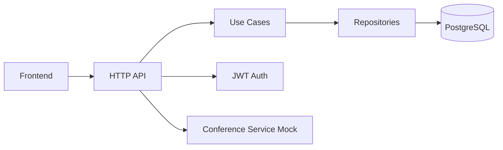

# Meeting Rooms API

<p align="center">
  
  
  
  
  
</p>

<p align="center">
  <strong>Полноценный пет-проект для управления переговорками: создание комнат, расписаний, генерация слотов, бронирование и аудиторский сценарий для админов.</strong>
</p>

> Это не просто CRUD-API. Это рабочий пример современного backend-проекта с чистой архитектурой, JWT, транзакциями, миграциями, OpenAPI, Swagger, фронтендом и full-stack тестированием.

---

## 🎯 Что это за проект

Meeting Rooms API — это backend-сервис и веб-интерфейс для бронирования переговорок внутри компании. Проект покрывает полный цикл:

- создание переговорных комнат;
- настройка расписания доступности;
- автоматическая генерация временных слотов;
- бронирование слотов пользователями;
- просмотр собственных и всех броней администратором;
- безопасная авторизация через JWT;
- визуальный фронтенд для быстрого взаимодействия с API.

Проект собран как хорошая отправная точка для pet-проекта, который можно показать работодателю, залить в портфолио и развивать дальше.

---

## ✨ Ключевые возможности

### Для администратора
- создание переговорных комнат;
- создание расписания доступности комнаты;
- просмотр всех броней с пагинацией;
- управление доступностью ресурсов через единый интерфейс.

### Для пользователя
- просмотр доступных переговорок;
- просмотр свободных слотов на выбранную дату;
- создание брони на свободный слот;
- просмотр своих будущих броней;
- отмена брони с идемпотентной логикой.

### Бизнес-логика
- слоты генерируются по расписанию;
- длительность слота фиксирована — 30 минут;
- одна активная бронь на один слот;
- попытка забронировать слот в прошлом запрещена;
- отмена брони не ломает сценарий и возвращает стабильный результат.

---

## 🧠 Архитектура и принципы



### Подходы, которые использованы в проекте
- чистая архитектура с разделением на adapter, usecase, domain, infrastructure;
- JWT для авторизации и разграничения ролей;
- транзакции для атомарности бизнес-операций;
- миграции базы данных;
- lazy generation слотов для снижения нагрузки и избежания избыточного хранения пустых данных;
- детерминированные UUID для слотов, чтобы избежать коллизий при параллельных запросах.

---

## 📚 API и документация

API описан в OpenAPI-спецификации:
- [backend/api/openapi.yaml](backend/api/openapi.yaml)

### Swagger / OpenAPI UI
Swagger доступен напрямую через backend:
- http://localhost:8080/swagger/
- http://localhost:8080/swagger/openapi.yaml

### Основные эндпоинты

#### Auth
- POST /register
- POST /login
- POST /dummyLogin

#### Rooms
- GET /rooms/list
- POST /rooms/create

#### Schedules
- POST /rooms/{id}/schedule/create

#### Slots
- GET /rooms/{id}/slots/list

#### Bookings
- POST /bookings/create
- GET /bookings/list
- GET /bookings/my
- POST /bookings/{id}/cancel

#### Health
- GET /_info

> В проекте также настроена публикация OpenAPI в GitHub Pages через CI/CD.

---

## 🖥️ Фронтенд

В репозитории есть простой и аккуратный веб-интерфейс для работы с сервисом:
- [frontend/index.html](frontend/index.html)
- [frontend/app.js](frontend/app.js)

### Что умеет фронтенд
- вход по роли через dummy login;
- просмотр комнат;
- выбор даты и отображение доступных слотов;
- создание бронирования;
- просмотр собственных броней;
- панель администратора для управления комнатами и аудитом.

### Где запускать
- backend: http://localhost:8080
- frontend: http://localhost:3000

---

## 🧱 Структура проекта

```text
.
├── backend/
│   ├── api/
│   │   └── openapi.yaml
│   ├── cmd/
│   ├── internal/
│   │   ├── adapter/
│   │   ├── app/
│   │   ├── domain/
│   │   └── infrastructure/
│   ├── migrations/
│   └── pkg/
├── docs/
│   └── api/
├── frontend/
├── docker-compose.yaml
├── .github/workflows/backend-workflow.yml
└── README.md
```

---

## 🧪 Тестирование

Проект покрыт разными уровнями тестирования:

- unit tests — бизнес-логика и use cases;
- integration tests — взаимодействие с PostgreSQL и слоями приложения;
- e2e tests — сценарии пользовательского пути через API.

### Что проверяется
- создание комнаты;
- создание расписания;
- генерация слотов;
- создание броней;
- отмена броней;
- ограничения доступа и роли;
- основные ошибки и edge cases.

---

## 🚀 CI / CD

В проекте настроен GitHub Actions workflow:
- [\.github/workflows/backend-workflow.yml](.github/workflows/backend-workflow.yml)

### Что выполняется в пайплайне
- linting;
- запуск unit тестов;
- запуск integration тестов;
- запуск e2e тестов;
- публикация OpenAPI-документации на GitHub Pages.

---

## ▶️ Как запустить локально

### 1) Подготовить окружение
Скопируйте пример окружения:

```bash
cp .env.example .env
```

### 2) Запустить проект через Docker Compose

```bash
docker compose up --build
```

### 3) Открыть интерфейсы
- Swagger: http://localhost:8080/swagger/
- Frontend: http://localhost:3000
- API: http://localhost:8080

---

## 📦 Технологический стек

- Go
- net/http (без лишних фреймворков)
- PostgreSQL
- Docker Compose
- JWT
- golang-migrate
- OpenAPI / Swagger
- GitHub Actions

---

## 🎬 Видео, GIF и анимации в README

Да, их можно и нужно вставлять в README — это сильно повышает “цепляющий” эффект.

### Рекомендуемый вариант
1. Сохраните видео или GIF в папку, например: `docs/assets/`
2. Вставьте их в README так:

```md
<p align="center">
  
</p>
```

или так для видео:

```html
<video controls width="900" autoplay loop muted playsinline>
  <source src="docs/assets/demo.mp4" type="video/mp4" />
</video>
```

### Что я бы рекомендовал добавить
- короткое демо по созданию комнаты;
- анимацию выбора слота и бронирования;
- ролик для админ-панели;
- короткий клип по успешному пути from login to booking.

---

## 🧭 Почему этот проект выглядит сильнее обычного CRUD

Потому что он демонстрирует не только базовую CRUD-логику, но и:
- продуманную бизнес-логику;
- архитектурный подход;
- документацию через OpenAPI;
- тестовую оболочку;
- CI/CD;
- UI-слой и эксплуатационные точки входа.

Это уже выглядит как проект, который можно показать как полноценный пример backend + API + frontend + devops.

---

## 🔥 В планах

- добавить больше сценариев в e2e;
- улучшить UI/UX фронтенда;
- добавить load testing;
- расширить observability и logging;
- сделать более “продакшн-ориентированный” деплой.

---

Если хотите, следующим шагом я могу сразу подготовить ещё и "премиум-версию" этого README: с более сильной продающей подачей, секцией "Demo", "Screenshots", "Architecture decisions" и более эффектным визуальным стилем под GitHub.
