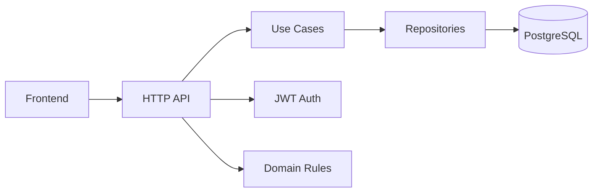
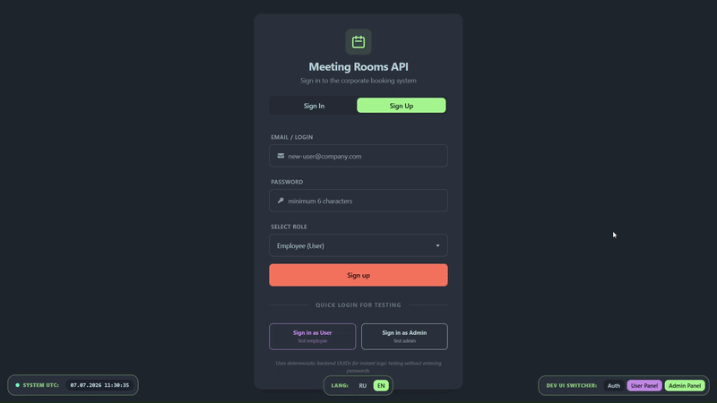
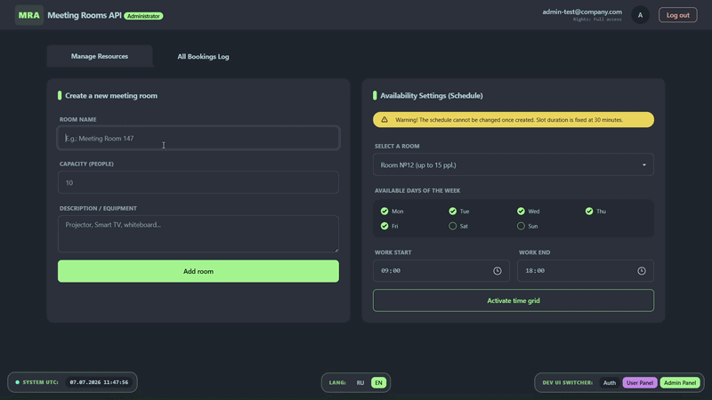
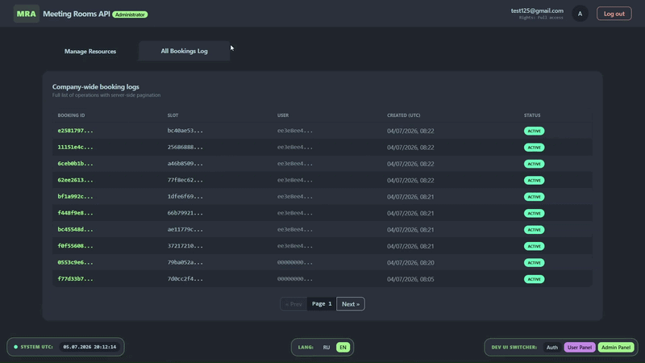
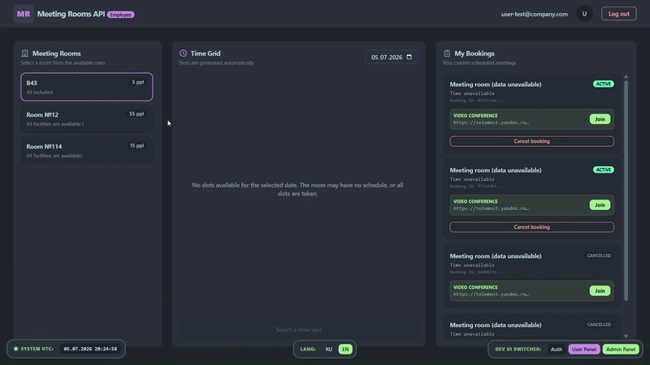

# Meeting Rooms API

<p align="center">
  <a href="README.md">🇬🇧 English</a> • <strong>🇷🇺 Русский</strong>
</p>

<p align="center">
  
  
  
  
  
  
  
  
</p>

<p align="center">
  <strong>Пет-проект в production-стиле для управления переговорными комнатами с реальной бизнес-логикой, аутентификацией, транзакционными сценариями, документацией API и полноценным демо-интерфейсом.</strong>
</p>

> Это не просто CRUD API. Это полноценный пример backend + frontend, который показывает чистую архитектуру, JWT-безопасность, миграции базы данных, транзакционную бизнес-логику, OpenAPI-документацию, автоматическое тестирование и структуру, готовую к развёртыванию.

---

## 🎯 Обзор проекта

Meeting Rooms API — это full-stack сервис для бронирования переговорных комнат в компании. Проект покрывает весь рабочий процесс:

- создание переговорных комнат;
- настройка расписания доступности;
- автоматическая генерация временных слотов;
- бронирование доступных слотов;
- просмотр личных и общих бронирований;
- защита API с помощью JWT;
- предоставление небольшого, но функционального веб-интерфейса.

Цель проекта — показать не только базовые CRUD-операции, но и практические инженерные решения, которые важны в реальных продуктах.

---

## ✨ Почему этот проект выделяется

Репозиторий сделан так, чтобы выглядеть как серьёзный портфельный проект, а не как учебный пример. Здесь сочетаются:

- чистая архитектура с отдельными слоями адаптеров, use cases, доменной логики и инфраструктуры;
- реальные бизнес-правила, такие как генерация слотов, валидация бронирований и поведение при отмене;
- транзакционная согласованность критичных операций;
- миграции базы данных и persistence на PostgreSQL;
- документация OpenAPI и Swagger UI;
- автоматические unit, integration и end-to-end тесты;
- генерация кода с sqlc, mockery и проверка качества с golangci-lint;
- лёгкий frontend для демонстрации API в действии.

---

## 🧩 Ключевые возможности

### Для администраторов
- создание переговорных комнат;
- настройка расписания комнат;
- просмотр всех бронирований с поддержкой пагинации и списков;
- управление доступностью через простой административный сценарий.

### Для обычных пользователей
- просмотр доступных комнат;
- просмотр свободных слотов на выбранную дату;
- бронирование доступного слота;
- просмотр будущих личных бронирований;
- отмена бронирований через идемпотентный сценарий.

### Особенности бизнес-логики
- слоты генерируются из расписания;
- длительность слота фиксирована и равна 30 минутам;
- допускается только одно активное бронирование на слот;
- попытка забронировать слот в прошлом отклоняется;
- отмена бронирования безопасна и предсказуема даже при повторных запросах.

---

## 🧠 Архитектура и принципы



Проект следует слоистой архитектуре с чёткими границами:

- слой адаптеров для HTTP-обработки;
- application layer для use cases и координации сценариев;
- domain layer для бизнес-правил и сущностей;
- инфраструктурный слой для JWT, хеширования паролей и интеграции с базой данных.

Дополнительные технические решения делают систему ближе к production:

- генерация слотов выполняется лениво, чтобы не заполнять базу миллионами пустых записей;
- временные слоты привязаны к сетке 30 минут;
- отмена бронирования идемпотентна и безопасна при повторных вызовах;
- используется детерминированная генерация UUID для слотов, чтобы избежать дублей при параллельных запросах.

---

## 🎬 Демонстрационные сценарии

### 1. Регистрация и вход



### 2. Управление комнатами и расписанием администратором



### 3. Аудит бронирований для администратора



### 4. Опыт бронирования для пользователя



---

## 📚 API и документация

API описан через OpenAPI и доступен через Swagger UI:

- [backend/api/openapi.yaml](backend/api/openapi.yaml)

### Swagger / OpenAPI endpoints
- http://localhost:8080/swagger/
- http://localhost:8080/swagger/openapi.yaml

### Основные эндпоинты

#### Auth
- POST /register
- POST /login
- POST /dummyLogin

#### Rooms
- GET /rooms/list
- POST /rooms/create

#### Schedules
- POST /rooms/{id}/schedule/create

#### Slots
- GET /rooms/{id}/slots/list

#### Bookings
- POST /bookings/create
- GET /bookings/list
- GET /bookings/my
- POST /bookings/{id}/cancel

#### Health
- GET /_info

> Публикация OpenAPI на GitHub Pages также настроена в CI workflow.

---

## 🖥️ Frontend

В проекте есть лёгкий frontend для демонстрации API:

- [frontend/index.html](frontend/index.html)
- [frontend/app.js](frontend/app.js)

### Что умеет frontend
- dummy login по ролям;
- просмотр комнат;
- выбор даты и визуализация слотов;
- создание бронирований;
- просмотр личных бронирований;
- административная панель для управления комнатами и аудитом.

### Локальные URL
- backend: http://localhost:8080
- frontend: http://localhost:3000

---

## 🧱 Структура проекта

```text
.
├── backend/
│   ├── api/
│   ├── cmd/
│   ├── internal/
│   │   ├── adapter/
│   │   ├── app/
│   │   ├── domain/
│   │   └── infrastructure/
│   ├── migrations/
│   └── pkg/
├── docs/
│   └── assets/
├── frontend/
├── docker-compose.yaml
├── .github/workflows/backend-workflow.yml
└── README.md
```

---

## 🧪 Стратегия тестирования

Проект покрыт несколькими уровнями тестирования:

- unit tests для доменной логики и use cases;
- integration tests для работы с persistence и application layer;
- end-to-end тесты для реалистичных сценариев API.

### Покрытые сценарии
- создание комнат;
- создание расписания;
- генерация слотов;
- создание бронирования;
- отмена бронирования;
- контроль доступа и ограничения по ролям;
- ошибки валидации и пограничные кейсы.

---

## 🚀 CI / CD

В репозитории есть workflow GitHub Actions для автоматической проверки качества:

- [.github/workflows/backend-workflow.yml](.github/workflows/backend-workflow.yml)

### Что делает pipeline
- линтинг;
- unit tests;
- integration tests;
- end-to-end tests;
- публикация OpenAPI-документации на GitHub Pages.

---

## ▶️ Как запустить локально

### 1) Подготовить окружение

Скопируйте пример файла окружения:

```bash
cp .env.example .env
```

### 2) Запустить стек через Docker Compose

```bash
docker compose up --build
```

### 3) Открыть приложение
- Swagger UI: http://localhost:8080/swagger/
- Frontend: http://localhost:3000
- API: http://localhost:8080

---

## 🛠️ Технологический стек

- Go
- net/http
- PostgreSQL
- Docker Compose
- JWT
- golang-migrate
- sqlc для генерации кода доступа к данным
- mockery для генерации моков в тестах
- golangci-lint для статического анализа и контроля качества
- OpenAPI / Swagger
- GitHub Actions

---

## 🔧 Engineering Highlights

Проект построен с практичным, production-minded набором инструментов и структурой, выходящей за рамки простого CRUD:

- DDD-inspired доменная модель с богатой логикой в [backend/internal/domain/model](backend/internal/domain/model) и интерфейсами репозиториев в [backend/internal/domain/port](backend/internal/domain/port);
- слоистая архитектура с разделением HTTP-адаптеров, use cases, доменной логики и инфраструктуры;
- миграции PostgreSQL под управлением golang-migrate в [backend/migrations](backend/migrations);
- генерация SQL-кода через sqlc, настроенная в [backend/sqlc.yaml](backend/sqlc.yaml) и лежащая в [backend/internal/adapter/out/postgres/sqlc](backend/internal/adapter/out/postgres/sqlc);
- моки, сгенерированные через mockery, для изоляции зависимостей и unit-тестирования в [backend/internal/domain/port/mocks](backend/internal/domain/port/mocks);
- golangci-lint, встроенный в CI через [backend/.golangci.yml](backend/.golangci.yml) и [.github/workflows/backend-workflow.yml](.github/workflows/backend-workflow.yml);
- несколько осознанных алгоритмических решений, которые делают поведение домена более реалистичным: генерация слотов выполняется лениво, временные окна следуют строгой сетке 30 минут, а отмена бронирования идемпотентна и безопасна.

Вместе эти решения делают репозиторий гораздо ближе к настоящему backend-сервису, чем к учебному примеру.
